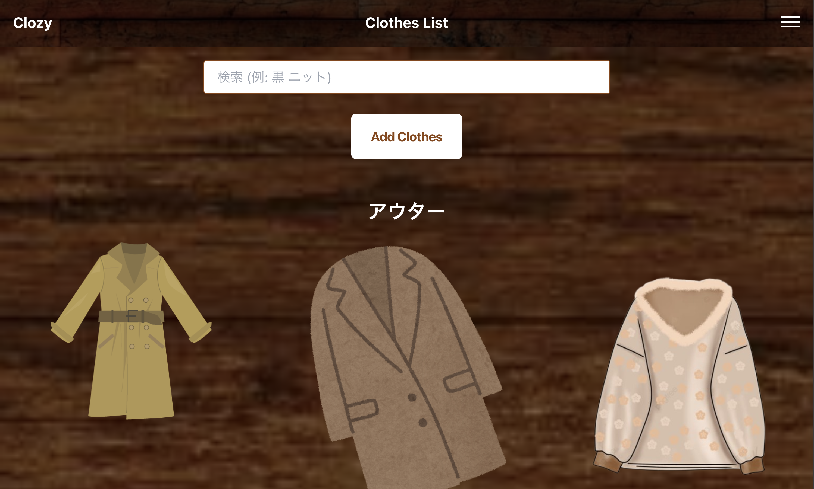

# clozy

This app manages your clothes.

Documentation is [here](./docs/HowToUse/README.md)

url : https://clozy.vercel.app/login



You can try it with the following account.
```
email: demo@example.com
password: pw
```

## setup

- install node and yarn
- install wrangler
- install vercel

```bash
make setup
```

## dev

```bash
make frontend-dev
```

```bash
make backend-dev
```

## deploy

```bash
make frontend-deploy
```

```bash
make backend-deploy
```
