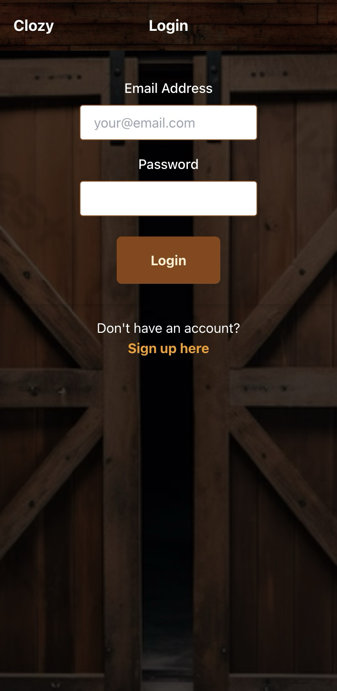
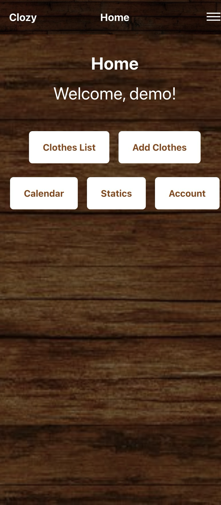
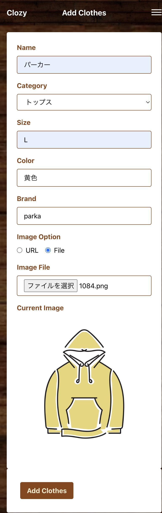
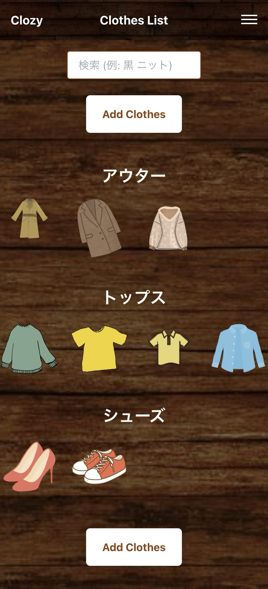
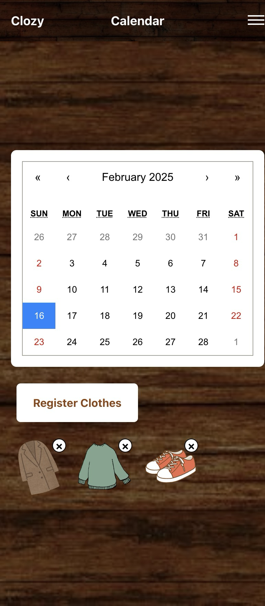
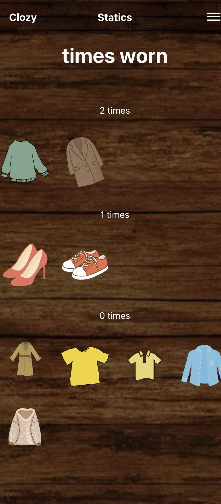

# How to use this app

This app manages your clothes.
The screen may change in appearance.

## login

You can login with email and password after registering.
>

## home

## add clothes

You can register the clothes you have.

## Clothes list

You can see the clothes you have registered and search for them.
You can also edit and delete the clothes.

## calendar

You can see the clothes you have worn in the past.

## statics

You can see statistics about the clothes you have worn.
Other statistics will be added in the future.

